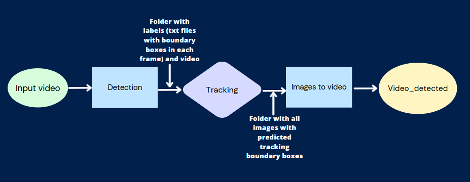
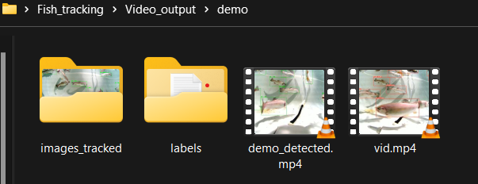
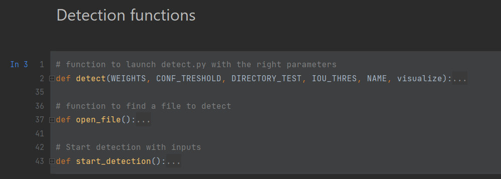
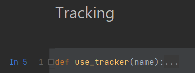
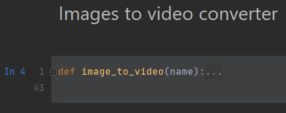
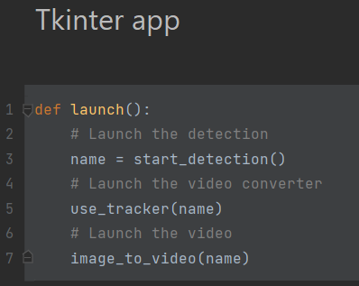
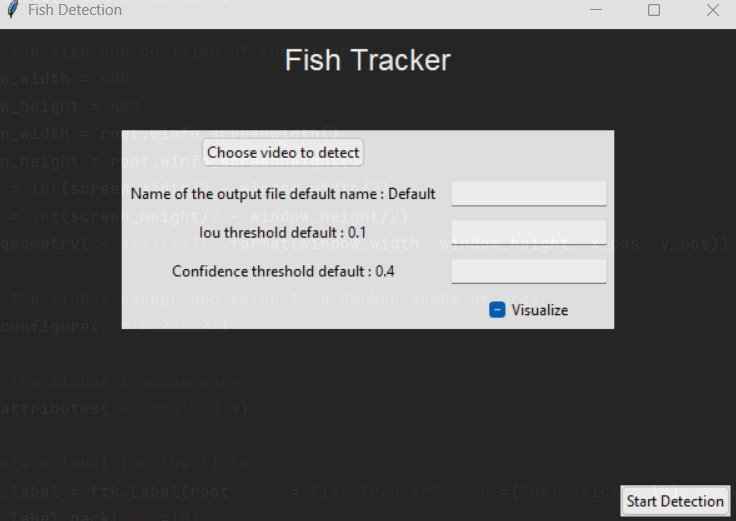

# FishTracking : Sort Method

Files description:
------------------

- `main.ipynb` is the file containing all the processing method.
- `yolov5` contain the Yolov5 model, needed by `main.ipynb`.
- `Video_input` folder should contain video that you want to process.
- `Video_output` contain the process video (file generate on running):
  - `Images_tracked` contain all images with tracking bounding boxes display on it, they are used to be assembled and make the video.
  - `Labels` contain for each frame in the video, the position of the bounding boxes (be careful with format as it can change, yolov5 and yolov8 don’t have the same input and output format, but you can convert and go to one another format)
  - `Demo_detected` is the video used with the tracking system.
  - `<name of the video that you use in input> (example here: vid)` is the video with boundary boxes from detection (yolov5).

In yolov5, the path used to the weight is `Fish_tracking\yolov5\runs\train\model\weights`, you can use your own but be careful with the path used in the jupyter notebook.

How to use the notebook:
------------------------

The notebook is split in different part corresponding to a step in the pipeline:

Those functions correspond to the detection part, the output are labels, and a video with boundary boxes from detection.
- `Open_file` is a function to select video from a window.
- `Start_detection` is the function used to get parameters from the tkinter app (we’ll see later what it is about). Note that if you want to use another trained model, you must change the path in this function and replace it with the location of your model.

Next step is tracking, we use Sort in this one but if you want to change to try another tracker you must replace this function and input your own tracking system in this function. This function use labels and your input video to create images with predicted boundary boxes with tracking system, so the output of this function is a folder filled with images.

This function get all the images from the tracking system, “images_tracked” folder, and create a video with all the images.

Finally, the tkinter app contains all the function that we just described, this function is used in a tkinter app when you press a button.

